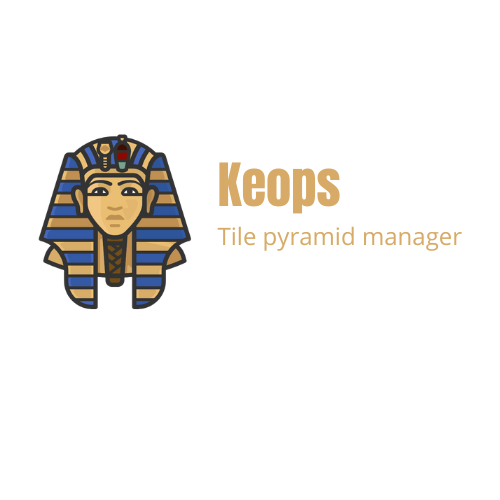

# Keops
[](https://www.repostatus.org/#wip)

<p align="center">
    
</p>

Keops is a CLI tool that allows you to apply some logic to vector tiles in an MBTiles, such as clipping by a GeoJSON mask, size optimization by removing unnecessary feautures in a given GL style, and much more.

_Still in development!_

## CLI Usage

The usage is pretty simple and straigthforward. For instance, if you want to drop a given tile in a MBTiles:

```bash
keops erase input.mbtiles 6/10/23
```

Keops have some more functionalities. To check them, simply execute ```keops``` or ```keops --help``` in your bash

```bash
Usage: keops [OPTIONS] COMMAND [ARGS]...

  Keops command line interface

Options:
  --help  Show this message and exit.

Commands:
  clip   Clip vector tiles to given geoJSON
  erase  Erase a tile in a MBTiles file
  size   Get the size of a given tile or zoom level in a MBTiles file
```

## Author

Fran Martín

## License
This project is licensed under the MIT License - see the [LICENSE](LICENSE.md) file for details.